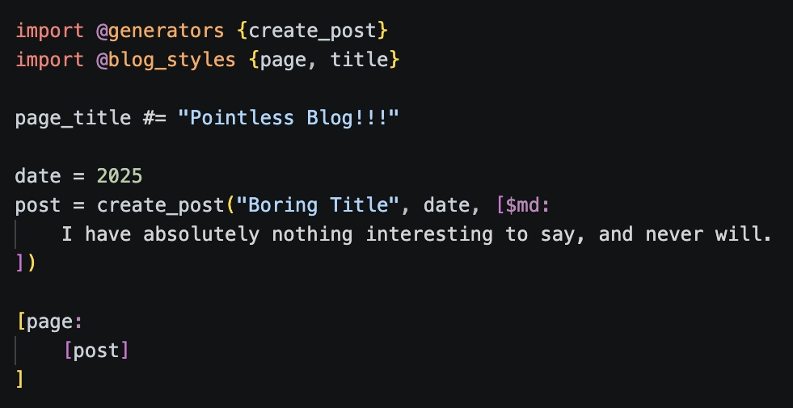
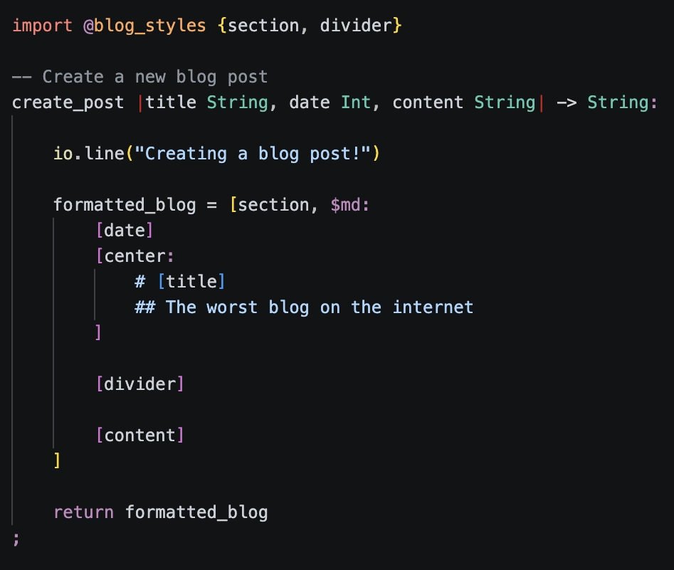
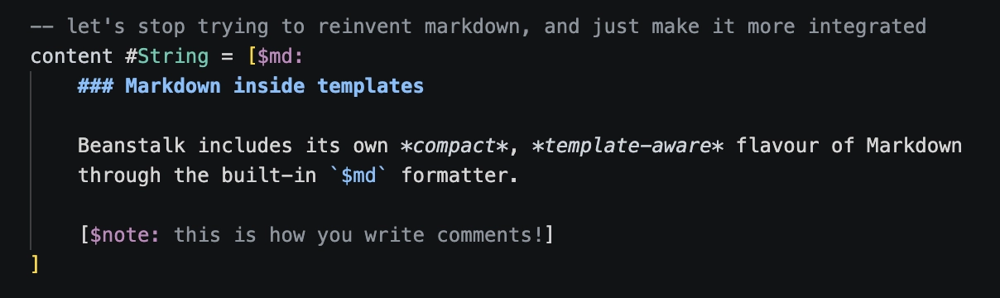

<div align="center">

# Beanstalk

<p><em>
  A language for creating reliable software in elegant codebases
</em></p>

# 🌱

<p>⚠️ This project is in early Alpha ⚠️</p> 

<p><a href="https://nyejames.github.io/beanstalk/">The documentation site</a> was created using <a href="https://github.com/nyejames/beanstalk/blob/main/docs/src">Beanstalk</a>. </p>

<p>Development is moving quickly. <a href="https://github.com/nyejames/beanstalk/blob/main/CONTRIBUTING.md">CONTRIBUTING</a> has more info if you want to get involved.</p>
</div>
<br>
<br>

<div align="center">

## What is Beanstalk?

</div>

Beanstalk is a small, statically typed and opinionated programming language. 

The goal is to provide everything you need. Designed from the ground up to work elegantly within one language and build system.

Web development is the current focus with the home-grown HTML project builder.




`@html` is a core library that gets you started with writing and generating HTML.

The HTML build system will generate an HTML page from this code:



<div align="center">

## Beanstalk  🤝  Markdown

</div>

Templates are first-class language values in Beanstalk.
They are the main way you create strings, but are far more powerful than regular string formatters. 



Markdown can live inside normal templates, so content can capture values, compose styles and fold straight into HTML at compile time.

This makes content-heavy pages quick to build and easy to format. 

No more TypeScript framework lasagne, build-tool linguini or 17 package dependency spaghetti for padding a string.

## Getting Started

`bean` is the project tool for creating, checking, building and running Beanstalk projects.
It's the CLI bundled with the compiler and build system.

Installation scripts will arrive for Beta, for now it's best to install manually from a tagged release.
(of which there are 0 atm, so you'll have to build from source)

### Create a project

```bash
bean new html my-site
cd my-site
```

### Run the development server

```bash
bean dev .
```

The dev server hot-reloads the project when files change automatically.

### Release build

```bash
bean build . --release
```

This compiles the project using the configured Beanstalk builder and writes output to the configured release directory.

<br>

<div align="center">
</div>

<div align="center">

## Goals 

</div>

- First-class string templates powerful enough to act as a small compile-time markup engine. They support built-in Markdown, formatting, slots and reactive runtime output.

- Readable, consistent syntax. Each keyword or symbol exclusively covers one concept (or as few as possible).

- Fast, modular tooling for short feedback loops and quick development builds (currently needs a lot more optimisation work).

- One batteries-included project tool for checking, building and running the development server.

- A small static type system plus borrow validation for memory-safe code that's free of data races and iterator invalidation by default.

- A GC fallback with ownership analysis that can remove runtime collection in ideal cases.

- A backend-neutral frontend. Wasm as the main, platform-agnostic workhorse output target (Wasm backend in development).

- As few dependencies as possible. A language project shouldn't need a PhD dissertation for a lockfile.

<div align="center">

## LLM-aware design

</div>

Developers are using coding agents increasingly as part of their workflow.

Programmers should own the final design and architecture. 
Agents can handle repetitive churn. 
Compilers should give detailed, fast feedback for producing reliable code.

A small syntax, strict rules, fast tooling and stable diagnostics make generated changes easier to inspect and validate.

Compiler diagnostics should carry stable codes, structured facts and source metadata for editors, development servers and coding agents.

Beanstalk has very little training data, but this may be useful later: 
examples can grow around the language that exists and the agent will have to follow your codebase style more strictly when there's no legacy patterns to hallucinate.

<div align="center">
  
## Documentation

</div>
<strong>
<li>
    <ul>
        <a href="https://nyejames.github.io/beanstalk/docs/">The language</a>
    </ul>
</li>
<br>
<li>
    <ul>
        <a href="https://nyejames.github.io/beanstalk/docs/codebase/compiler-design/">Compiler design</a>
    </ul>
</li>
<br>
<li>
    <ul>
        <a href="https://nyejames.github.io/beanstalk/docs/codebase/memory-management/">Memory management</a>
    </ul>
</li>
<br>
</strong>

<div align="center">

## Tools

</div>

<a href="https://github.com/nyejames/beanstalk-plugin">Syntax highlighting for Visual Studio Code</a>

(LSP and more tooling to come in the future as the language stabilises)

<div align="center">
<br>

## Development Progress

</div>

Here is the current <a href="https://nyejames.github.io/beanstalk/docs/progress/">progress matrix</a>.

The compiler already has broad frontend, backend and build-system tooling in place.

The language semantics and implementation is still settling.

<br>
